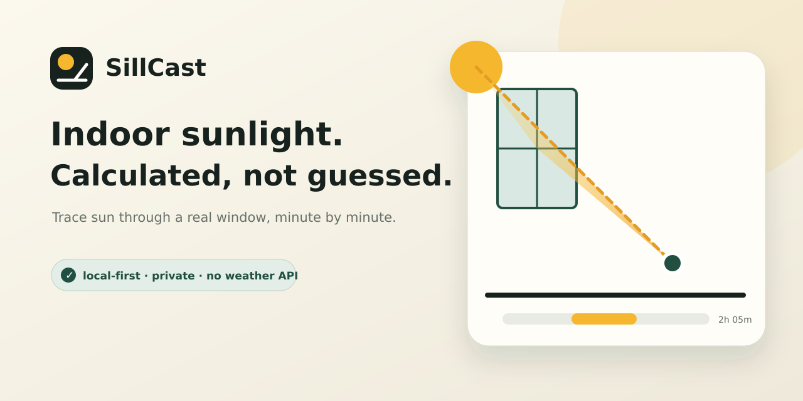

<p align="center">
  
</p>

<p align="center">
  <a href="https://github.com/KanadeK/sss/actions/workflows/ci.yml"></a>
  <a href="https://github.com/KanadeK/sss/releases"></a>
  <a href="LICENSE"></a>
  <a href="https://kanadek.github.io/sss/"></a>
</p>

# SillCast

SillCast is a local-first indoor sunlight planner. Give it a location, date, rectangular
window, and a point inside the room; it calculates when a direct solar ray can actually
pass through that aperture and reach the point.

It is useful for placing houseplants, avoiding monitor glare, finding a pet's winter sun
spot, and planning natural-light photography. The browser app and CLI use the same tested
geometry engine.

**[Open the live planner](https://kanadek.github.io/sss/)**

## Why this exists

Most plant apps record care, light sensors measure a spot after the fact, and outdoor
shadow maps model streets or buildings. SillCast answers a narrower question before you
move anything:

> At this exact indoor position, on this date, when can the sun pass through this exact
> window?

Our research found related tools, but no mature open-source project centered on this
window-aperture/indoor-point workflow. See [the research and competitor notes](docs/RESEARCH.md).

## Real functionality

- Solar azimuth and altitude from an absolute instant and WGS84 latitude/longitude.
- IANA time-zone handling, including daylight-saving offsets.
- Three-dimensional ray/aperture intersection against a measured window.
- Exact direct-sun intervals at 1, 5, 10, 15, or 30-minute resolution.
- Top-down room heatmap that reuses the same solar samples for hundreds of positions.
- Full-year monthly exposure profile.
- Daily CSV evidence and versioned JSON scenario/result export.
- Browser geolocation only after an explicit click; there are no analytics or network APIs.
- Headless CLI and importable TypeScript library—not just a visual interface.
- English and Simplified Chinese UI.

## Quick start

Requires Node.js 22 or newer.

```bash
git clone https://github.com/KanadeK/sss.git
cd sss
npm ci
npm run dev
```

Then open the local URL printed by Vite.

### CLI

```bash
npm run build:package
node dist-package/cli.js examples/tokyo-south-window.json
node dist-package/cli.js examples/london-east-desk.json --format csv --out exposure.csv
```

Example:

```text
Scenario: Tokyo south-window plant
Date: 2026-10-15 (Asia/Tokyo)
Direct sun: 245 minutes
Intervals: 09:10-13:15
Aperture-weighted exposure: 2.72 hours
Resolution: 5 minutes
```

The example above is generated by v0.1.0 from the checked-in fixture.

### Library

```ts
import { simulateDay, type Scenario } from "sillcast";

const scenario: Scenario = {
  site: { latitude: 35.6762, longitude: 139.6503, timeZone: "Asia/Tokyo" },
  window: { azimuthDeg: 180, widthM: 1.8, heightM: 1.5, sillHeightM: 0.7 },
  target: { lateralM: 0.15, depthM: 1.1, heightM: 0.65 },
  date: "2026-10-15",
  stepMinutes: 5,
};

console.log(simulateDay(scenario).intervals);
```

## Model boundaries

SillCast is a deterministic geometry model, not a weather forecast or photometer. Version
0.1 assumes:

- a clear astronomical horizon;
- one vertical rectangular aperture;
- no balcony, tree, neighboring building, curtain, blind, screen, or interior obstruction;
- no glass transmission loss or cloud cover;
- a point target rather than the full canopy/object volume.

The result means **direct geometric line of sight to the sun**, not total illuminance or
plant Daily Light Integral. Read [the model and equations](docs/MODEL.md) before using the
output for design decisions.

## Verification

The release gate is one command:

```bash
npm run check
```

It runs formatting, linting, strict TypeScript checks, unit/integration/UI tests with
coverage thresholds, both production builds, the real CLI against example data, and an
HTTP smoke test against the built site.

Create reproducible release assets:

```bash
npm run package:release
(cd release && sha256sum -c SHA256SUMS)
```

If a gate fails, follow the bounded repair loop in
[docs/RELEASE.md](docs/RELEASE.md): diagnose the first failing layer, make the smallest
fix, rerun that layer, then rerun `npm run check`. A release must never be tagged with a
failing or skipped gate.

## Repository map

```text
src/core/          Solar, time-zone, aperture, exposure, heatmap, and export engine
src/App.tsx        Complete interactive planner
src/cli.ts         Headless CLI using the same engine
tests/             Unit, integration, UI, and validation tests
examples/          Real runnable scenario fixtures
docs/              Research, model, validation, privacy, release, and roadmap
.github/workflows  CI, Pages deployment, and idempotent release automation
scripts/           Runtime smoke test and deterministic release packaging
```

## Privacy and security

The production bundle contains no analytics, fonts, maps, trackers, account system,
backend, or third-party API. Manual coordinates and exported files stay on the device.
Browser geolocation is requested only after the user clicks **Use my location**.

See [PRIVACY.md](docs/PRIVACY.md) and [SECURITY.md](SECURITY.md).

## Contributing

Small, evidence-backed pull requests are welcome. Please read
[CONTRIBUTING.md](CONTRIBUTING.md) and include tests for changes to geometry or time-zone
logic.

## 中文简介

SillCast 是一个完全本地运行的室内直射阳光预测器。输入经纬度、IANA
时区、日期、窗户朝向与尺寸，以及房间内目标点的位置，即可计算阳光何时真正穿过窗洞照到该点，并生成全天时间轴、房间热力图、全年概况和
CSV/JSON 凭证。它不是天气预报，也不会上传位置数据。

## License

[MIT](LICENSE) © 2026 KanadeK
